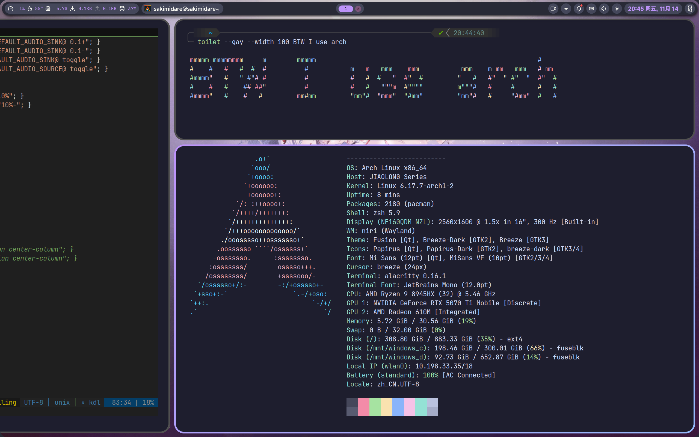
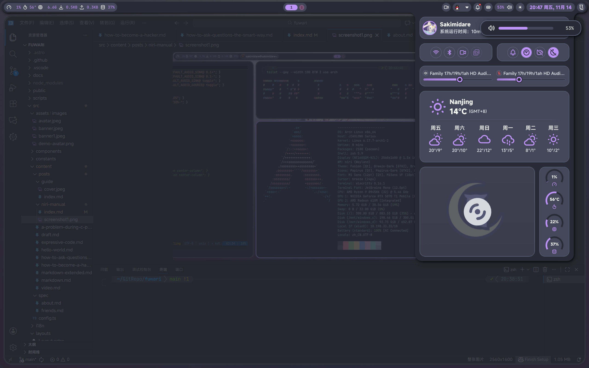
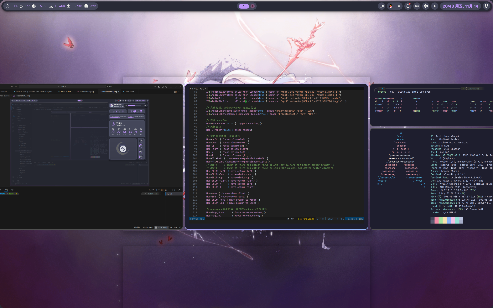

# Niri 简介

:::hyperlink{href="https://wiki.archlinux.org/title/Niri" title="Niri" avatar="https://wiki.archlinuxcn.org/favicon.ico" description="Arch Linux 的 Niri 介绍"}
:::

Niri 和 我们熟悉的 Windows 桌面或 KDE Plasma 不同。他是一个水平式排列的窗口管理器。每当新打开一个窗口，便会显示在当前窗口的右侧（而非像 Windows 那样堆叠）。在 Niri 中，没有开始按钮、没有最小化、没有最大化，有的只是随心所欲用快捷键和触摸板切换窗口的流畅操作和炫酷动画！

# 成品图

话不多说，赶快端上成品图：





通知栏的图标暂时没有配置，不过问题不大。想拥有这个炫酷 WM (Window Manager) 吗？跟我一步一步配置，你也可以做到！

# 安装步骤

:::note
下面的安装步骤假定你已经安装好了 Arch Linux。如果并非如此，请参阅其他安装 Arch Linux 的教程。我推荐阅读 [Archwiki](https://wiki.archlinuxcn.org/wiki/%E5%AE%89%E8%A3%85%E6%8C%87%E5%8D%97)。
:::

:::warning
以下教程对你有以下要求：
1. 耐心，愿意试错；
2. 阅读过[提问的智慧](https://www.sakimidare.top/posts/how-to-ask-questions-the-smart-way/)；
3. 有初步的 Linux 知识；
:::


开始之前，放几个链接：

:::hyperlink{href="https://yalter.github.io/niri/Getting-Started.html" title="Niri" avatar="https://yalter.github.io/favicon.ico" description="Niri 项目维护者的教程"}
:::

:::github{repo="YaLTeR/niri"}
:::

## 安装 Niri 软件包


:::warning

Niri 并不像 KDE Plasma 和 Xfce 一样附带了一系列 GUI 程序可以开箱即用。因此，你可能需要安装附加程序如 `blueman` 来管理蓝牙设备、`dolphin` 来浏览文件、`alacritty` 来运行终端、`gwenview` 来看图、 `vlc` 打开媒体、`fcitx5` 作为中文输入法、`noto-fonts`来显示中文字体等等。具体安装步骤不再赘述，请参阅[Arch Linux 中文维基](https://wiki.archlinuxcn.org/)获得必要信息。

另外，如上文所述，本文假定你是一个 Linux 用户。所以你的电脑上理应有 `git` `yay` `gcc` `clang` `rust`  `make` `python`等最基本的软件包。Niri 使用 Rust 编写，所以你得安装 `rust` 软件包来执行 `make` 操作。如有这些软件包缺失，请自行安装。
:::

你可以用这两条命令：

```sh
sudo pacman -S niri xdg-desktop-portal-gtk xdg-desktop-portal-gnome alacritty swaybg swayidle hyprlock xwayland-satellite dolphin sddm brightnessctl wireplumber grim flameshot breeze wshowkeys-git fcitx5 fcitx5-qt fcitx5-chinese-addons blueman noto-fonts libnotify pipewire pipewire-pulse
yay -S noctalia-shell vicinae ttf-jetbrains-mono misans 

```
安装必要的软件包。

Noctalia Shell 是一个使用 Material Design 的用户界面。它可以接管系统通知，声音和显示亮度调节，并在最上方显示一个很他吗炫酷的状态栏。

Vicinae 是一个 App 启动器，可以把它理解为 Windows 上的开始菜单。在我的配置中，所有不在快捷键配置里的程序都需要从这里启动。

## 配置

## SDDM
Niri 安装完成后，会自动创建 `.desktop` 文件。这个 `.desktop` 文件会被 SDDM 识别并提供登录到会话的选项。如果你还没有使用 SDDM 作为登录管理器，请先启用服务。

```sh
sudo systemctl enable sddm.service
```

这样在系统开机时会自动运行 SDDM，以便启动 Niri 会话。

## 编辑 niri.service 的 wants

```sh
systemctl --user add-wants niri swayidle
```

这样做可以让 `swayidle` 软件包接管锁屏、睡眠等系统操作。
:::note
不需要照着官方文档加上 `waybar` 和 `mako`！我的配置没装这两个软件包，Shell 和通知全由 Noctalia Shell 接管！
:::

编辑 `~/.config/systemd/user/niri.service.wants/swayidle.service`。
填入以下配置：

```ini
[Unit]
PartOf=graphical-session.target
After=graphical-session.target
Requisite=graphical-session.target

[Service]
ExecStart=/usr/bin/swayidle -w timeout 601 'niri msg action power-off-monitors' timeout 600 'hyprlock' before-sleep 'hyprlock'
Restart=on-failure
```

这个配置是为了无操作 600 秒后用 `hyprlock` 锁屏，601 秒后关闭显示器。
如果有睡眠、休眠等需求，请查阅 Swaylock 官方文档。

## 修改 Niri 配置文件

创建 `~/.config/niri/config.kdl` 文件并写入配置。
除了显示器配置，其他你可以抄我的。显示器配置请根据注释自行修改。

``` typescript
// 键盘鼠标触摸板等输入设备相关配置
input {
    keyboard {
        xkb {
            layout "us"
        }

        // 在启动上启用numlock，省略此设置会禁用它。
        numlock
    }

    touchpad {
        tap
        natural-scroll
        scroll-method "two-finger"
    }

    mouse {
        // 设置鼠标移动速度,-1到1之间由慢到快
        accel-speed 1
    }

    // niri默认接管电源按钮的功能是sleep,这里禁用以使用关机功能
    disable-power-key-handling
    // 切换mod键：正常使用alt，嵌套窗口内使用Super。
    mod-key "Super"
    mod-key-nested "Alt"
}

// 可以在niri实例中运行`niri msg outputs`找到显示器名称。
output "HDMI" {
    // 取消注释以禁用此显示器。
    off

    // 默认聚焦在这个显示器
    focus-at-startup

    // 格式为"<width>x<height>" 或者 "<width>x<height>@<refresh rate>".
    // 如果省略了刷新率，niri将为分辨率选择最高的刷新率。
    mode "3840x2160@60.000"

    // 您可以使用整数或分数量表，例如，比例为150％。
    scale 2

    // transform允许逆时针旋转显示，有效值为:
    // normal, 90, 180, 270, flipped, flipped-90, flipped-180 and flipped-270.
    transform "normal"

    // 输出在所有显示器坐标空间中的位置。未明确配置位置的显示器将放置在所有已放置的显示器右侧。
    // position x=1280 y=0
}

// 如果 eDP-2 没有连接，将会默认聚焦在这个显示器
output "eDP-2" {
    // off
    focus-at-startup
